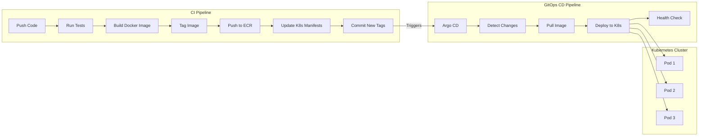

# Hello World CI/CD Learning Project

## Project Overview
This project is a hands-on learning exercise to understand and implement modern CI/CD practices. It uses a simple Node.js Hello World application as a base to demonstrate containerization, automated testing, and deployment pipelines.

## Learning Objectives & Skills Practiced
- Setting up automated CI/CD pipelines with GitHub Actions
- Docker containerization and image tagging strategies
- Test automation with Jest
- GitOps practices with Argo CD
- Infrastructure as Code (future implementation with Terraform)
- Container orchestration with Kubernetes (planned)

## Technologies Used
- **Application**: Node.js
- **Testing**: Jest
- **Containerization**: Docker
- **CI/CD**: GitHub Actions
- **Registry**: Amazon ECR
- **Orchestration**: Kubernetes (planned)
- **GitOps**: Argo CD (planned)

## Project Structure
```
hello-pipeline/
├── app.test.js           # Jest tests
├── Dockerfile            # Container definition
├── hello-world.js        # Main application
├── package.json          # Dependencies and scripts
└── .github/workflows/    # GitHub Actions definitions
    └── ci-cd.yml        # Pipeline configuration
```

## Pipeline Flow


## Key Features
1. **Automated Testing**
   - Jest-based unit tests
   - Tests run on every push and PR
   - Pipeline fails if tests fail

2. **Docker Image Management**
   - Semantic versioning for releases (v1.0.0)
   - Latest tag for main branch
   - Automated tagging based on git events

3. **CI/CD Pipeline**
   - Automated builds on push to main
   - Version-tagged releases
   - Multi-stage deployment process

## How to Run Locally

1. **Clone the Repository**
```bash
git clone <https://github.com/EdwinAndrew/hello-pipeline>
cd hello-pipeline
```

2. **Install Dependencies**
```bash
npm install
```

3. **Run Tests**
```bash
npm test
```

4. **Build Docker Image**
```bash
docker build -t hello-pipeline:latest .
```

5. **Run Container**
```bash
docker run -p 3000:3000 hello-pipeline:latest
```

## Pipeline Behavior

### On Push to Main
- Runs all tests
- Builds Docker image
- Tags as 'latest'
- (Future) Updates deployment

### On Version Tag (v*)
- Runs all tests
- Builds Docker image
- Tags with version and 'latest'
- (Future) Triggers release deployment

## Future Enhancements
1. Kubernetes deployment configuration
2. Argo CD integration
3. Infrastructure as Code with Terraform
4. Enhanced monitoring and logging
5. Automated rollback procedures

## Learning Outcomes
This project demonstrates practical implementation of:
1. CI/CD principles and best practices
2. Container image versioning strategies
3. Automated testing integration
4. GitOps workflow patterns
5. Cloud-native application deployment

